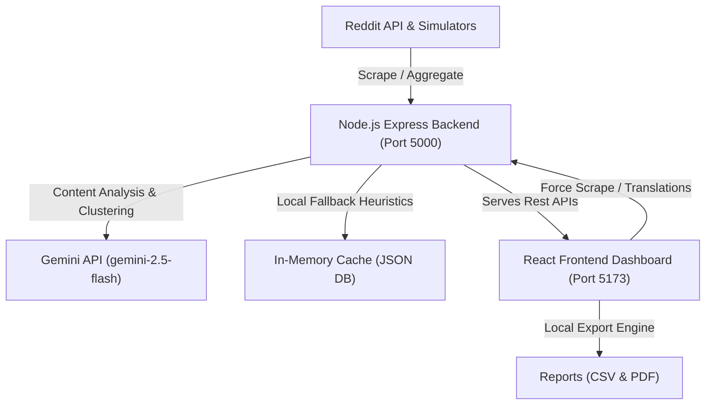

# Passport Intelligence Dashboard: Technical Guide

This document provides a comprehensive walkthrough of the **Passport Intelligence Dashboard** codebase. It outlines the project's system architecture, component breakdowns, data flows, and specialized features.

---

## 1. System Architecture

The application is structured as a decoupled full-stack system:

### Components Summary
1. **Frontend (React + Vite + Vanilla CSS)**: Renders a premium, glassmorphism dark-mode interface with robust search, multi-faceted filtering, grouped/clustered thread views, on-demand translators, and data export.
2. **Backend (Node.js + Express)**: Manages in-memory cache, runs real-time scrapers, interfaces with the Google GenAI SDK, and serves REST endpoints.
3. **Scraper Service**: Merges public Reddit search results with diverse multi-platform simulated feeds (Twitter, YouTube, LinkedIn, Facebook, TikTok).
4. **Gemini Service**: Integrates the Google GenAI SDK to perform translation, classification, summarization, and clustering. Features an automatic fallback system to switch to heuristic-based rule sets if the API key is missing or rate limits (e.g. Free Tier's 5 RPM) are hit.

---

## 2. Backend Service Layer Details

The backend files are located in the [backend](file:///d:/LPU/Sem-4/T/project/backend) folder:

### 1. Server Core: [server.js](file:///d:/LPU/Sem-4/T/project/backend/server.js)
* **Ports**: Runs on port `5000` (or `PORT` environment variable).
* **Caching**: Stores posts in an in-memory array (`processedPosts`), `spamPostsCount`, and `lastScrapedTime`.
* **Boot Behavior**: Automatically starts an initial background scrape and processing pipeline on startup.
* **REST Endpoints**:
  * `GET /api/posts`: Serves the current cached feed (triggers scraping if cache is empty).
  * `POST /api/posts/scrape`: Force-triggers the aggregator pipeline and returns refreshed, enriched data.
  * `POST /api/posts/translate`: Takes `{ postId, targetLanguage }` and returns the translation.
  * `GET /api/stats`: Dynamically computes platforms, categories, sentiments, and regions metrics.

### 2. Scraper Service: [scraperService.js](file:///d:/LPU/Sem-4/T/project/backend/services/scraperService.js)
* **Reddit Search**: Fetches the 15 newest posts from `https://www.reddit.com/r/all/search.json?q=passport&sort=new&t=day`.
* **Multi-Platform Simulator**: Combines Reddit data with 12 mock posts (`SIMULATED_POSTS`) containing diverse platforms (Twitter, YouTube, LinkedIn, Facebook, TikTok), regions, languages, and raw content.
* **Spam & Deduplication**: Cleans overlapping post IDs to prevent duplicates.

### 3. Gemini Service: [geminiService.js](file:///d:/LPU/Sem-4/T/project/backend/services/geminiService.js)
* **SDK Usage**: Imports `@google/genai` to initialize `new GoogleGenAI({ apiKey })`.
* **AI Features**:
  1. `translatePost`: Translates content on-demand into one of 10 target languages.
  2. `processPost`: Sends post content to `gemini-2.5-flash` in JSON Mode, requesting classification of `isGibberish`, `category`, `summary` (~30 words), `sentiment`, `region`, and `language`.
  3. `clusterPosts`: Groups duplicate or highly similar posts together using an LLM grouping prompt to assign `clusterId` and `clusterTitle` values.

> [!TIP]
> **Gemini Free Tier Quotas & Fallback Resilience**:
> The Gemini Free Tier key has a rate limit of **5 requests per minute**. Because the initial scrape fetches ~27 posts and processes them sequentially, the app will hit rate limits (HTTP 429) or high-demand timeouts (HTTP 503).
> 
> The backend contains a robust **Heuristic-based Fallback Processor** which automatically catches these errors. If an API request fails, it uses fast local rules (regex, keyword checking) to assign categories, sentiment, regions, and summaries, guaranteeing the pipeline completes successfully without losing data.

---

## 3. Frontend Architecture

The frontend files are located in the [frontend](file:///d:/LPU/Sem-4/T/project/frontend) folder:

### 1. Root & State: [App.jsx](file:///d:/LPU/Sem-4/T/project/frontend/src/App.jsx)
* **State Hooks**: Manages fetched posts, statistics, loading indicators, force-scraping processes, and error statuses.
* **Search & Filters**:
  * **Search**: Real-time keyword matching across title, content, summary, author, region, and category.
  * **Dropdowns**: Filter by *Platform*, *Category*, and *Sentiment*.
  * **Sort**: Sort by *Newest*, *Oldest*, and *Highest Engagement* (likes + shares + comments).
* **Clustered Topic View**: Group posts by `clusterId`. For groups with >1 post, it renders an expandable/collapsible thread header (`📚 Grouped Topic: ...`) showing only the parent post, with a button to toggle the full thread.

### 2. UI Components: [src/components/](file:///d:/LPU/Sem-4/T/project/frontend/src/components)
* [DashboardStats.jsx](file:///d:/LPU/Sem-4/T/project/frontend/src/components/DashboardStats.jsx): Displays metrics grid cards, including total posts, spam filtered, sentiment counts, and the highest-volume category.
* [FiltersBar.jsx](file:///d:/LPU/Sem-4/T/project/frontend/src/components/FiltersBar.jsx): Integrates the keyword search bar, the clustered topic view checkbox toggle, and dropdown filters.
* [PostCard.jsx](file:///d:/LPU/Sem-4/T/project/frontend/src/components/PostCard.jsx):
  * Displays brand-colored platform icons (e.g. 𝕏, r/, 📷).
  * Showcases category and sentiment badges (green, gray, red).
  * Houses the **AI Summary Box**.
  * Contains the **Dynamic Translation Panel** dropdown, executing translations and rendering the translated text inline with a one-click clear button.
  * Lists engagements (👍, 🔁, 💬), region (📍), and language (🌐) details in the footer.

### 3. Data Export: [export.js](file:///d:/LPU/Sem-4/T/project/frontend/src/utils/export.js)
* **CSV Export**: Cleans newlines, escapes quotation marks, lists headers, and downloads the currently filtered posts as a spreadsheet.
* **PDF Report**: Generates a printer-friendly layout in a new window, rendering statistics, summaries, and post snippets in a styled tabular structure, and triggers the browser print dialog.

---

## 4. Design Aesthetics & Custom Styling
The interface is designed with a premium glassmorphic dark-mode configuration, set up in [index.css](file:///d:/LPU/Sem-4/T/project/frontend/src/index.css). It uses:
* **Typography**: Modern typography utilizing Google Fonts.
* **Color Scheme**: Harmonious dark backgrounds with transparent card overlays (`backdrop-filter: blur()`), glowing borders, and platform-specific accent variables.
* **Animations**: Animated loading spinners, button hover expansions, and card transitions.
