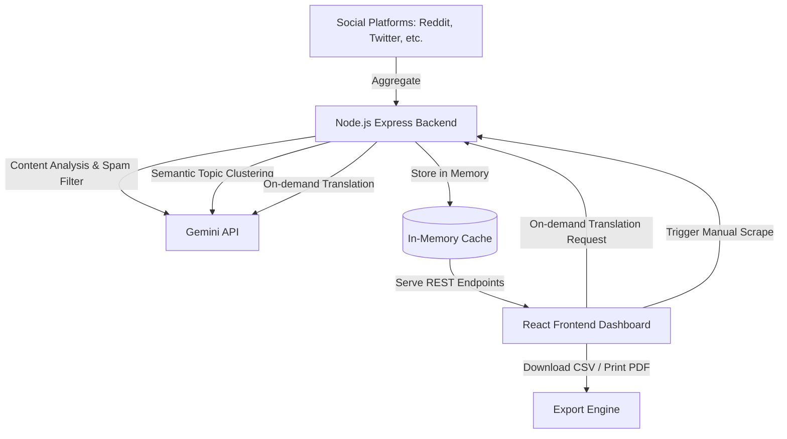

# Passport Intelligence Dashboard: Social Media Scraper

A full-stack social media aggregator and intelligence dashboard designed to monitor and organize passport-related posts from the last 24 hours. The application uses a Node.js Express backend and a React (Vite) frontend styled with a modern, glassmorphism dark-mode theme in Vanilla CSS. 

All core processing task (summarization, categorization, sentiment classification, gibberish filtering, topic clustering, and translations) are handled directly via the **Gemini API** using the Google GenAI SDK.

---

## Architecture Overview



### Main Components
1. **Frontend (React + Vite + Vanilla CSS)**: A high-fidelity, interactive single-page dashboard featuring search, multi-faceted filtering, a clustered thread view, on-demand translators, and data export.
2. **Backend (Node.js + Express)**: Fetches posts in real-time, runs the processing pipeline, handles caching, and provides clean REST endpoints.
3. **Scraper Service**: Uses a hybrid approach combining a live, unauthenticated search fetch of Reddit's public API (`/r/all/search.json`) and a realistic simulator for other major platforms (Twitter, YouTube, LinkedIn, Instagram, TikTok) with diverse handles, times, regions, and languages.
4. **Gemini API Integration**: Leverages `gemini-2.5-flash` with JSON-mode output to handle text classification, summarization, clustering, and translation, including a heuristic-based simulated fallback mode in case of missing or invalid API keys.

---

## API Endpoints

### 1. Get Posts
- **Endpoint**: `GET /api/posts`
- **Description**: Returns all clean, processed, and clustered social media posts. Runs the scraper on first load if the cache is empty.
- **Response Format**:
```json
{
  "posts": [
    {
      "id": "reddit_abc123",
      "platform": "Reddit",
      "handle": "/u/username",
      "authorName": "Author Name",
      "content": "Full original post content...",
      "timestamp": "2026-05-27T03:45:00.000Z",
      "region": "India",
      "language": "English",
      "category": "Tatkal",
      "sentiment": "positive",
      "summary": "AI summary of the post...",
      "clusterId": "cluster_tatkal",
      "clusterTitle": "Tatkal Passport Application Experiences"
    }
  ],
  "spamCount": 2,
  "lastScraped": "2026-05-27T04:00:00.000Z",
  "isScraping": false
}
```

### 2. Force Scrape
- **Endpoint**: `POST /api/posts/scrape`
- **Description**: Force-triggers the scraper pipeline to pull fresh data, send contents to the Gemini processing engine, run clustering, and refresh the cached database.

### 3. Translate Post
- **Endpoint**: `POST /api/posts/translate`
- **Description**: Translates a specific post's text on-demand to one of 10 supported languages using the Gemini API.
- **Request Body**:
```json
{
  "postId": "reddit_abc123",
  "targetLanguage": "Spanish"
}
```
- **Response Format**:
```json
{
  "postId": "reddit_abc123",
  "targetLanguage": "Spanish",
  "translatedText": "Translated content in Spanish..."
}
```

### 4. Fetch Statistics
- **Endpoint**: `GET /api/stats`
- **Description**: Compiles summary statistics on the processed feed.
- **Response Format**:
```json
{
  "totalPosts": 25,
  "spamCount": 2,
  "lastScraped": "2026-05-27T04:00:00.000Z",
  "platforms": { "Reddit": 15, "Twitter": 6, "Facebook": 4 },
  "categories": { "Tatkal": 8, "Appointments": 10, "Visa": 7 },
  "sentiments": { "positive": 10, "neutral": 12, "negative": 3 },
  "regions": { "India": 14, "France": 3, "Global": 8 }
}
```

---

## Setup & Running Guide

### Prerequisites
- Node.js (v18+)
- npm

### 1. Clone & Setup Backend
1. Open a terminal in the `backend/` directory:
   ```bash
   cd backend
   npm install
   ```
2. Create a `.env` file from the example:
   ```bash
   cp .env.example .env
   ```
3. Add your **Gemini API Key** to `.env` (optional; if left blank, the app runs in fallback simulation mode using heuristics):
   ```env
   GEMINI_API_KEY=your_gemini_api_key_here
   ```
4. Start the server:
   ```bash
   npm run start
   ```
   The backend will run on `http://localhost:5000`.

### 2. Setup & Run Frontend
1. Open a new terminal in the `frontend/` directory:
   ```bash
   cd frontend
   npm install
   ```
2. Start the development server:
   ```bash
   npm run dev
   ```
   The dashboard will open on `http://localhost:5173`.

---

## Design and Features
- **Visual Design**: Premium glassmorphism dark-mode UI with vibrant brand accents per platform, custom animated loading spinners, hover transformations, and a clean responsive grid.
- **Topic Clustering**: Collapses duplicate or highly similar posts under a single thread header. The parent thread can be expanded to view the full discussion, preventing duplicate cards from cluttering the dashboard.
- **Search & Filter**: Real-time keyword matching across original text, author handles, regions, and AI summaries, combined with category, platform, and sentiment dropdown filters.
- **On-Demand Translations**: Supports English, Hindi, Punjabi, Spanish, French, German, Arabic, Chinese, Russian, and Japanese with instant rendering and clear indicators.
- **Reports Export**: Instantly download data in CSV spreadsheet format or open a printable window to save the dashboard summary as a PDF.
